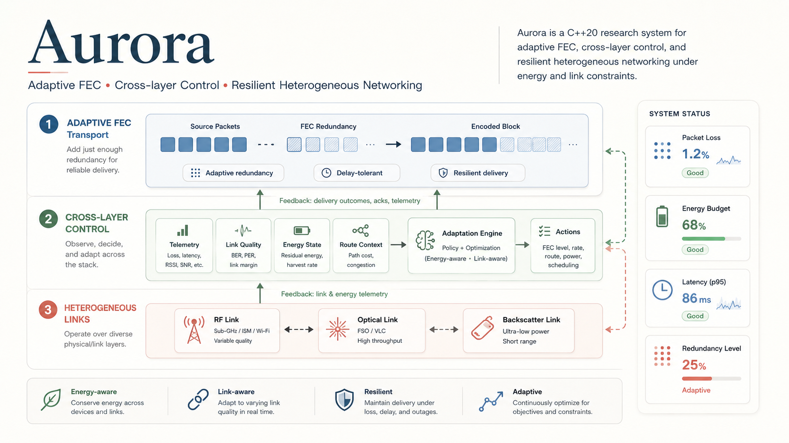

# Aurora

> Bio-inspired adaptive transport and cross-layer control research engine for resilient heterogeneous networks.

<p align="center">
  
</p>

<p align="center">
  <em>Adaptive FEC, cross-layer control, and heterogeneous links in one feedback-driven networking system.</em>
</p>

[](LICENSE)

Aurora-X is an ambitious systems research project exploring a long-term goal:

> Can a network transport substrate observe its own condition, protect different classes of information according to intent, adapt coding and physical-link decisions under stress, preserve energy and duty-cycle constraints, and recover safely after severe disruption?

The current repository contains a substantial C++20 research implementation covering fountain-style forward error correction, adaptive redundancy, traffic classes, simulated RF/optical/backscatter links, energy and RIS models, supervisory state, cross-layer optimization, signed payloads, telemetry, UDP experiments, and an interactive dashboard.

Aurora-X is **not yet a field-deployed extreme-network stack**, a validated replacement for established FEC standards, or a production security system. The internal LT-like simulator now has a coherent descriptor-driven path for deterministic concurrent generation arrivals and decoding, but its channel, energy, safety-state, HAL, dashboard, and security layers still include simulation or prototype behaviour that must not be used for quantitative field claims.

The project is not being reduced in scope. Its engineering path and maximum target architecture are defined in [`AURORA_X_MASTER_PLAN.md`](AURORA_X_MASTER_PLAN.md).

---

## Mission

Aurora-X aims to become a contract-aware, self-observing transport layer for environments where conventional assumptions fail:

- intermittent and asymmetric connectivity;
- severe packet loss and rapidly changing channels;
- constrained batteries and harvested energy;
- regulatory duty-cycle limits;
- heterogeneous links such as RF, optical, backscatter, and future physical interfaces;
- delay-tolerant, store-and-forward, and multi-node operation;
- high-value payloads requiring integrity, provenance, and differentiated protection;
- links assisted by programmable surfaces or other environmental infrastructure.

The biological terminology is a design metaphor for control behaviour, not a claim of biological equivalence:

- **NERVE** — latency-sensitive traffic;
- **GLAND** — high-reliability state or control traffic;
- **MUSCLE** — elastic or bulk traffic;
- **panic response** — temporary fast increase in protection after failure;
- **memory** — persistent per-flow adaptation state;
- **recovery** — controlled return toward lower overhead after sustained success.

---

## Current status

**Stage:** advanced cross-layer research prototype and simulator  
**Language:** C++20, with optional Python dashboard tooling  
**Primary current task:** preserve and review the completed eight-block condition study and its frozen evidence; no regional, calibrated, hardware or field claim is authorized

| Area | Current state | What is already present | Important limitation |
|---|---|---|---|
| Fountain FEC | Internal experiment plus external baseline | Deterministic LT-like codec and an optional, pinned Wirehair adapter using its explicit frozen `FIXUPS_2026_07` wire profile; both traverse the same descriptor/report lifecycle and complete-stack benchmark | The internal codec is not a standard; Wirehair is a simulation baseline, not authenticated framing, and its adapter requires segments with at least two source symbols |
| Generation lifecycle | Implemented first vertical slice | Parsed `TransportContract`, immutable `GenerationDescriptor`, generation-indexed encoder/decoder state, independent segment expiry, bounded deterministic runtime repair emission, exact length, integrity result and authoritative per-segment `DecodeReport` evidence | Descriptor integrity uses a research checksum, not authenticated metadata; the in-memory generation store is bounded but not persistent |
| Adaptive transport policy | Modular prototype | Injected codec and policy interfaces, fixed policies, NERVE/GLAND/MUSCLE adaptive policy, bounded per-generation manager, failure response and gradual relaxation | Threshold, PID and risk-sensitive alternatives are not implemented; current evidence remains synthetic despite covering multiple channel traces |
| Cross-layer channel optimizer | Implemented prototype | RF/IR/backscatter selection, urgency, reliability target, energy and duty inputs, UCB or SNR selection, an isolated replayable proposal RNG, and a complete contact/deadline-aware benchmark path | Uses synthetic channel and hardware models; comparative results remain simulation evidence rather than calibrated performance claims |
| Transport health | Implemented first slice | Consumes only `DecodeReport`; progress polls update coverage without being counted as delivery failures | Aggregation/confidence and multi-flow recovery semantics still need development |
| Safety supervision | Partial | Hard envelope constrains generation/segment expiry, freshness, post-action reserve, allowed and in-contact links, simulated RF airtime, active-segment repair capacity and critical protection; timestamped health evidence expires deterministically, while the supervisory monitor preserves its bounded window and hysteresis transition state for replay | Thresholds and the default 5-second evidence lifetime remain configurable research values rather than calibrated field limits |
| Operating modes | Implemented prototype | CONSERVATIVE, NORMAL, and AGGRESSIVE policies | The default single-flow scenario provides limited transition evidence |
| Energy, channel, RIS and link models | Implemented simulation | Battery state, harvesting, contract-configured simulation-time duty accounting, LBT, fading/PER functions, geometry, RIS phases, RF/IR/backscatter costs | These are research models, not calibrated physical hardware implementations; realtime HAL duty remains a separate path |
| Hardware abstraction | Interface and mocks | Radio, IR, backscatter, RIS, SPI, I²C and GPIO facade; build provenance labels this path `field-experimental` and keeps `hardware_validated=false` | `FIELD_BUILD` currently still uses stubbed device operations and cannot produce field-evidence claims |
| Cryptographic payload integrity | Optional real path | Ed25519 through libsodium when explicitly enabled | Standalone builds without libsodium use a deterministic placeholder and must not be treated as secure |
| Process emulation | Implemented authenticated independent-VM slice | Separate sender/receiver processes multiplex two generations over direction/session-bound process frames, replay independent forward and reverse impairment traces, reject replays with a reorder-tolerant window, expose independent IPv4 endpoints, and apply monotonic policy feedback; protocol V2 echoes the authenticated forward sequence so the sender records same-clock feedback RTT summaries; CI exercises distinct Docker namespaces and two fresh GitHub-hosted Ubuntu VMs, while retained GCP records include a same-commit N=10 campaign, a historical balanced 2×2 matrix, the randomized 12-lifecycle Measurement Contract V2 pilot and the completed powered eight-block follow-up | Real HMAC requires `USE_SODIUM=ON`; feedback RTT includes application, impairment, network and polling service and is not network-only latency; the powered result supports only the declared emulation-condition contrast and does not authorize regional, calibrated, hardware or field claims |
| Telemetry and replay | Implemented prototype | Deterministic `(time, phase, sequence)` event kernel, JSONL telemetry, V6 decision traces, V7 simulator event ledgers, canonical contact and V2 generation-arrival schedules, benchmark channel traces, and a strict-vs-fair scheduler harness; paired replay reconstructs causal planning, turns and effective service | The current transport model still schedules a periodic 1000 ms quantum and requires arrivals on that boundary; the fairness bound applies to turns, not effective service; concurrent/mobile nodes and imported emulation traces remain outside the model |
| Interactive dashboard | Visual monitoring prototype | Dash/Plotly process launcher, health plots, KPI cards, and parameter controls | The engine currently does not reload the configuration file written by the sliders |
| Automated tests | Registered with CTest and GitHub Actions | Contract semantics, deterministic repair emission, panic bounds, rolling windows, HAL/duty/contact refusal, critical scheduling, proposal/RNG/UCB replay, concurrent scheduled arrivals, simulator/contact event replay, stale-health expiry, supervisory transition replay, channel-trace integrity, process-protocol corruption rejection, authenticated feedback-sequence correlation, sender-clock RTT invariants, randomized-pilot integrity, two-process loopback emulation, isolated baselines, external Wirehair correctness and end-to-end benchmark determinism | Property fuzzing and calibrated hardware tests are still missing |
| Reproducible build | Dependency-light profile working | C++20 CMake build, explicit seeds, paired simulator-event/decision replay, replayable benchmark channel traces, Wilson confidence intervals, per-trial records and configure-time build/profile fingerprints | Provenance and checksum chains detect reproducibility failures and corruption but do not authenticate the producing build |

---

## What has been achieved

### 1. A real fountain-style coding experiment

Aurora-X includes an internal FEC implementation that:

1. splits a payload into source symbols;
2. emits seeded XOR combinations;
3. reconstructs the corresponding binary equations at the receiver;
4. solves the system over GF(2);
5. returns the recovered payload when the generation reaches sufficient rank.

This is a real encoder/decoder experiment. It is intentionally described as **LT-like** rather than as a standards-compliant RaptorQ replacement.

### 2. Parsed transport contracts and explicit generations

`TransportContract::parse()` now rejects unknown or invalid requirements and represents deadline, reliability, duty, allowed links, reserve floor, observation freshness, repair caps, integrity policy, experiment seed, and caller-declared byte ranges. It does not infer the meaning of payload bytes.

Each spawn produces an immutable `GenerationDescriptor` containing codec identity/version, generation and token IDs, exact payload length, symbol size/count, segment requirements, coding seeds/overhead, creation/expiry, and research integrity fingerprints. Decoder state is stored per generation ID in a bounded store, so multiple generations can be active and integrated out of order.

The current contract surface is classified explicitly in `transport_contract_semantic_audit`:

| Classification | Fields |
|---|---|
| Enforced | version, global and per-segment deadlines, duty fraction, allowed links, RIS tile count, minimum source reserve, observation freshness, maximum repair amplification, minimum critical overhead, generation/source limits, integrity requirement, experiment seed, segment ranges and segment importance |
| Policy input | global reliability, per-segment target reliability, selector choice and generation importance |
| Unsupported | payload-semantic interpretation; Aurora transports opaque bytes |

“Policy input” does not mean an achieved SLA. Global reliability selects protection behaviour; per-segment target reliability orders eligible runtime repairs after importance and before deadline. `SegmentDecodeReport::observed_target_met` records exact success in one trial, not an ensemble guarantee.

### 3. Adaptive protection with memory

Per flow class and priority, the organism tracks:

- critical and bulk overhead;
- genetic baseline overhead;
- average coverage;
- success and failure counts;
- good and bad streaks;
- temporary panic state consumed by exactly the next configured number of generated generations;
- a configurable genotype policy.

Failures can increase future redundancy rapidly, while sustained successful operation can reduce it gradually toward the baseline.

### 4. A cross-layer simulation environment

The engine combines coding decisions with models of:

- RF, optical, and backscatter transmission;
- energy expenditure and harvesting;
- duty-cycle availability;
- listen-before-talk behaviour;
- synthetic SNR, fading, and packet error probability;
- obstacles and programmable-surface paths;
- deadline pressure and remaining decode work.

### 5. Supervisory and optimization layers

Aurora-X includes experimental layers for:

- aggregated flow health;
- safety state classification;
- conservative, normal, and aggressive operation;
- SNR-based or UCB-based physical-link selection;
- telemetry-driven feedback.

The main simulator now runs from a deterministic priority queue ordered by timestamp, event phase and insertion sequence. Generation arrivals precede transport work at the same timestamp; each transport quantum schedules its successor explicitly. Simulation research runs no longer wait on wall-clock pacing, although they consume the same pacing RNG so canonical traces remain unchanged; interactive and field-experimental paths retain realtime waits. The optimizer then passes through the hard `SafetyEnvelope`, transmits the organism's spawned packets, and feeds the same authoritative `DecodeReport` to delivery and health. V6 decision traces replay proposal, action and supervisory transitions, while the paired V7 simulator ledger reconstructs the fixed-node event stream. Future generation IDs are reserved without calling the policy; arrival-time planning consumes all earlier feedback. Each quantum identifies the granted scheduler turn and separately records HAL-accepted effective service. The committed regression gate fixes the canonical V7/V6 SHA-256 outputs, so the kernel migration preserves the prior observable trace byte for byte. This proves the implemented simulation path and causal ordering, not calibrated thresholds or hardware behaviour.

### 6. Security and provenance experiments

The repository includes:

- token serialization;
- signatures;
- optional real Ed25519 through libsodium;
- Merkle-style proof-of-delivery experiments.

Secure claims apply only to builds explicitly using the real cryptographic backend.

### 7. Process-separated transport emulation

`aurora_process_emulation` runs sender and receiver roles in separate OS processes. Its default smoke workload serves two generations; the fixed policy-pilot workload serves eight generations sequentially so authenticated terminal feedback is applied before the next policy plan. The receiver keeps decoder-only state keyed by generation identity, without access to source payloads, and returns progress or terminal `DecodeReport` summaries to a separately configured feedback destination. Receiver deadline outcomes use only its own `steady_clock`: the first accepted descriptor is the local origin and authenticated descriptor deadlines are relative durations, never sender expiry timestamps. The sender accepts feedback monotonically: terminal reports are sticky, and reordered reports cannot regress decoder rank or observed-symbol count. `--policy` selects `fixed-minimum`, `fixed-class-aware` or `biological-adaptive` at runtime in the same binary; `--workload` selects the frozen workload. Bind and destination IPv4 literals are independent, so the same roles can be configured across hosts. CI exercises them in distinct Docker network namespaces and on independent GitHub-hosted VMs over Tailscale; retained records additionally exercise public IPv4 routing between non-peered GCP VPCs in different regions.

Process protocol V2 adds `echoed_forward_sequence` to authenticated feedback.
The sender records the first wire emission of each authenticated forward
sequence and correlates it with the first monotonic feedback that echoes it.
The resulting all-feedback and terminal-feedback min/mean/max values use only
the sender's `steady_clock`; duplicate terminal feedback is excluded and an
unknown echo fails the evidence contract. This removes cross-host clock
subtraction, but the interval still includes receiver processing, configured
reverse impairment, network service and sender polling. It is therefore an
application feedback RTT, not network-only or one-way latency.

Forward symbol attempts and reverse feedback attempts are driven by independent checked-in impairment traces. V1 binds cyclic `P` (pass), `D` (drop) and `U` (duplicate) actions to a scenario name and FNV-1a checksum. V2 uses `action@delay-ms` events, capped at 60 seconds. Events index their channel's attempt order; release time is ordered first and attempt index breaks ties. A delayed earlier event can therefore be overtaken by a later immediate event reproducibly. Forward descriptor retransmission remains outside impairment; the reverse trace covers descriptor acknowledgements, progress reports and repeated terminal reports.

Descriptor, symbol and feedback payloads retain their bounded versioned checksum envelope. Every UDP datagram is additionally wrapped in a process-authentication envelope binding direction, 64-bit session ID, 64-bit sequence number, payload length and tag. With `USE_SODIUM=ON`, the tag is HMAC-SHA-256 from libsodium; a 64-packet bitmap window accepts bounded UDP reordering while rejecting duplicates and old replays. Possession of the pre-shared key establishes session-peer provenance, not ownership of an IP address.

With `USE_SODIUM=OFF`, the same envelope and replay invariants use a deterministic placeholder tagged `insecure-test-placeholder-mac`. That profile is a regression oracle only and is not authentication. CI includes a separate Ubuntu `secure-auth` job that installs libsodium and runs the authentication unit test plus the complete two-process path under the real backend. The checked-in key is public test material and must never be reused as a deployment secret.

The smoke harness uses two generations; the policy pilot uses the frozen eight-generation segmented workload. The container-host job builds one libsodium-enabled image, runs all six policy-condition cells with that image under distinct network namespaces and IPv4 addresses, and retains logs plus topology/authentication manifests. It proves authenticated framing, replay rejection, process/channel separation, runtime policy selection and release ordering across that declared bridge topology. Because both containers still share one runner and Docker bridge, it does not prove Internet behaviour, independent-machine success, calibrated timing or field performance.

---

## Current internal generation path

The dependency-light simulator now follows one path:

```text
TransportContract
   ↓
reserve deterministic generation identity (no policy planning)
   ↓
declared arrival → TransportPolicy + GenerationCodec
   ↓
GenerationManager::spawn_reserved() → GenerationDescriptor
   ↓
SafetyEnvelope → deterministic repair emission → exact recorded execution
   ↓
HAL acceptance → simulated channel → receiver
   ↓
GenerationManager::integrate()
   ↓
authoritative DecodeReport
   ↓
FlowHealth → replayable proposal controller → SafetyEnvelope
   ↓
DecisionReplayLog V6 + action and supervisory feedback
```

The same report determines delivery, coverage/rank, critical completion, integrity outcome, and health feedback. A decision trace is saved only after runtime execution counts have been attached and checked against the constrained decision. The former monolithic delivery decoder and parallel organism health decoder were removed from the active simulator path.

The process-separated path makes the transport boundary explicit:

```text
sender process                         receiver process
GenerationManager                     GenerationReceiver(descriptor)
       |                                      |
       +-- descriptor + symbols --UDP-------->+
       |                                      |
       +<-- DecodeReport feedback --UDP-------+
       |
TransportPolicy::observe(remote feedback)
```

The current boundary is intentionally narrow:

- symbol count;
- original payload length;
- critical and bulk boundaries;
- symbol size;
- encoder identity and version;
- generation identifier;
- adaptation parameters used at spawn time;
- bounded in-memory state for concurrent generations.

`AlienFountainOrganism` remains as a compatibility facade that composes a transport policy, a generation codec and the generation manager. Fixed policies and codecs can be injected independently in tests and benchmark runs. The optional Wirehair adapter implements this same lifecycle, including exact source length and completion-gated progress. The old RaptorQ switch remains a disabled legacy integration stub.

---

## Target architecture

Aurora-X is intended to evolve toward the following layered system:

```text
Application intent and mission constraints
                  ↓
        Intent compiler / policy contract
                  ↓
     Adaptive coding and generation manager
                  ↓
  Custody, fragmentation, provenance and security
                  ↓
 Cross-layer optimizer and safety supervisor
                  ↓
Link abstraction: RF | optical | backscatter | future
                  ↓
 Network, hardware-in-the-loop, or physical hardware
                  ↓
      Telemetry, digital twin and verification
```

The complete target includes:

- concurrent, independently decodable generations;
- class-aware and deadline-aware coding;
- online channel estimation;
- constrained adaptation rather than unconstrained heuristic tuning;
- multi-hop custody and delay-tolerant forwarding;
- authenticated generation metadata;
- hardware-backed keys where available;
- real link adapters;
- digital-twin replay;
- reproducible benchmark scenarios;
- formal safety invariants for adaptation boundaries;
- comparison against established baselines.

See [`AURORA_X_MASTER_PLAN.md`](AURORA_X_MASTER_PLAN.md) for the complete path.

---

## Repository structure

```text
aurora_x.cpp                 Main simulation/orchestration harness
aurora_extreme.hpp           Channel, energy, optimizer and shared models
aurora_organism.hpp          Compatibility facade for the biological policy
aurora_intention.hpp         Transitional include for TransportContract
aurora_hal.hpp               Hardware abstraction and current mock backends
include/aurora/
  control/                   Proposal replay and transport policy interfaces
  fec/                       Codec interface, LT-like codec and Wirehair adapter
  emulation/ProcessProtocol.hpp Versioned forward/reverse UDP framing
  transport/                 Contract, descriptor, manager, report and health
  transport/GenerationReceiver.hpp Decoder-only remote generation state
  safety/SafetyEnvelope.hpp  Hard transport-decision constraints and trace
  telemetry/DecisionReplayLog.hpp  Canonical decision log and verifier
  telemetry/SimulationEventLedger.hpp  Inter-step simulator event ledger
  simulation/DeterministicEventKernel.hpp Deterministic event queue/order
  simulation/ContactSchedule.hpp       Canonical link-contact windows
  simulation/GenerationArrivalSchedule.hpp Canonical external arrivals
  simulation/GenerationScheduler.hpp       Strict or aging/fair EDF selector
  simulation/GenerationSchedulerBenchmark.hpp Adversarial scheduler comparison
  simulation/ChannelTrace.hpp      Canonical channel traces and generators
  simulation/BaselineBenchmark.hpp Replayable statistical comparison harness
apps/
  aurora_replay.cpp          Independent proposal/action/safety replay tool
  aurora_contact_schedule.cpp Canonical contact-schedule creator
  aurora_generation_arrivals.cpp Canonical generation-arrival creator
  aurora_scheduler_benchmark.cpp Strict-vs-fair starvation benchmark
  aurora_transport_benchmark.cpp Complete deterministic transport comparison
  aurora_process_emulation.cpp Separate sender/receiver UDP roles
  aurora_benchmark.cpp       CSV baseline runner
benchmarks/
  generation_scheduler_sweep_v2.csv Canonical scheduling-turn regression report
  end_to_end_transport_sweep_v1.csv Canonical complete-stack regression report
  gcp_raw_region_condition_matrix_v1.json Fixed balanced 2×2 GCP matrix
  gcp_raw_measurement_pilot_v2.json Randomized 12-lifecycle variance pilot
  gcp_raw_powered_condition_study_v3.json Powered-study preregistration
  gcp_raw_powered_condition_v3_campaign_*.json Four fixed campaign shards
  process_measurement_contract_v2.json Machine-readable clock/boundary rules
  raw_public_host_matrix_v1.txt Retained descriptive 2×2 GCP evidence
  raw_public_host_measurement_pilot_v2.txt Randomized V2 pilot evidence
  process_zero_delay_*_v1.trace Same drop/duplicate actions without added delay
include/aurora/emulation/
  Measurement.hpp           Sender-clock feedback RTT correlation
tools/
  gcp_raw_host_emulation.py Guarded single/campaign lifecycle harness
  gcp_raw_host_matrix.py Plan, execute, validate and clean the fixed matrix
  gcp_raw_power_analysis.py Reconstruct pilot contrasts and verify study power
src/core/
  AuroraSafetyMonitor.hpp    Legacy safety-state prototype
tests/
  test_aurora_organism.cpp   Generation/FEC lifecycle invariants
  test_transport_contract.cpp
  test_safety_envelope.cpp
  test_decision_replay.cpp
  test_modular_transport.cpp
  test_process_protocol.cpp  Descriptor/symbol/feedback and remote decode
  run_process_emulation.py   Two-process loopback regression harness
  test_baseline_benchmark.cpp
  test_channel_trace.cpp
  test_deterministic_event_kernel.cpp
  test_simulation_event_ledger.cpp
  test_contact_schedule.cpp
  test_generation_arrival_schedule.cpp
  test_generation_scheduler.cpp
  test_generation_scheduler_benchmark.cpp
aurora_batch_test.cpp        Experimental parameter sweep harness
aurora_dash_lab.py           Live monitoring dashboard
Orginal/                     Historical source snapshot; not the active implementation
```

---

## Build

### Core research build

The dependency-light build uses the internal LT-like FEC and placeholder signatures:

```bash
cmake -S . -B build \
  -DCMAKE_BUILD_TYPE=Debug \
  -DUSE_SODIUM=OFF \
  -DUSE_RAPTORQ=OFF \
  -DBUILD_NET_TOOLS=ON \
  -DBUILD_TESTING=ON

cmake --build build --config Debug
ctest --test-dir build --output-on-failure
```

Run:

```bash
./build/bin/aurora_x
```

On multi-configuration Windows generators the executable may be under `build/bin/Debug/`.

Run the two process roles manually on separate terminals, with distinct forward and reverse UDP ports:

```bash
./build/bin/aurora_process_emulation receiver 127.0.0.1 47001 127.0.0.1 47002 2 benchmarks/process_feedback_v2.trace benchmarks/process_auth_test.key 0123456789abcdef
./build/bin/aurora_process_emulation sender   127.0.0.1 47001 127.0.0.1 47002 benchmarks/process_timed_v2.trace benchmarks/process_auth_test.key 0123456789abcdef
```

Or run the automated launcher, which selects free loopback ports and verifies both process exit codes plus terminal feedback application:

```bash
python tests/run_process_emulation.py ./build/bin/aurora_process_emulation benchmarks/process_timed_v2.trace benchmarks/process_feedback_v2.trace benchmarks/process_auth_test.key 0123456789abcdef
```

Build and run the authenticated container-host profile:

```bash
docker build -f tests/Dockerfile.process-emulation -t aurora-process-emulation:local .
bash tests/run_container_host_emulation.sh aurora-process-emulation:local process-host-evidence
```

This produces `sender.log`, `receiver.log`, and `manifest.txt`. The manifest declares the distinct container addresses, ports, session, real HMAC profile, and exit status. The checked-in key and session are public deterministic test fixtures, not deployment secrets. This is stronger than loopback process evidence but remains a single-machine Docker experiment.

The manually dispatchable `authenticated-remote-host-emulation` workflow also
builds one libsodium-enabled binary and runs it on two fresh GitHub-hosted
Ubuntu VMs connected as ephemeral, least-privilege Tailscale nodes. Sender and
receiver derive a unique per-run process key, retain independent manifests and
connection-path logs, and feed a paired evidence verifier. Same-repository pull
requests may exercise this profile; fork pull requests cannot receive its
secrets. A successful artifact proves execution on distinct VMs over the
declared encrypted overlay, not raw public-Internet routing or field hardware.

A separate retained GCP evidence record runs the same commit and one
libsodium-enabled binary on `e2-micro` sender and receiver VMs in `us-east1`
and `us-west1`. Each VM belonged to a different custom VPC with no peering.
The forward and reverse firewall rules admitted only UDP 47001 and 47002 from
the peer's exact public and private `/32` addresses. Because the VPCs were not
peered, the private ranges supplied no route between hosts; packet capture
confirmed the public sender address at the receiver boundary. Both roles completed two generations,
applied two authenticated feedback reports, and rejected replayed datagrams.
The VMs, boot disks, and ephemeral addresses were deleted after collection,
and the post-run audit returned zero instances, disks, reserved addresses, or
snapshots. See [`benchmarks/raw_public_host_evidence_v1.txt`](benchmarks/raw_public_host_evidence_v1.txt).

The guarded GitHub harness has now reproduced that topology once from `main`
using keyless OIDC/Workload Identity Federation. The authenticated transport
again completed both generations and applied both feedback reports while
rejecting four sender-side and five receiver-side replays. Application timing
was 426 ms at the sender and 1201 ms of receiver service; controller-observed
readiness, sender wall time, and total wall time were 3004.135 ms, 2955.916 ms,
and 6825.887 ms respectively. Primary teardown, independent teardown, and a
separate post-run audit all found zero run-prefixed VM, disk, address,
snapshot, firewall, subnet, or network resources. See
[`benchmarks/raw_public_host_evidence_v2.txt`](benchmarks/raw_public_host_evidence_v2.txt).

The guarded workflow then executed 10 sequential, independent lifecycles from
commit `889aa1f4d21edc2246e755c7b934b27de89a4272`. Every sample recreated both
VPCs and VMs, used the same runtime binary hash, completed two authenticated
generations and two feedback applications, rejected four sender-side and five
receiver-side replays, and passed primary plus independent exact-prefix
teardown. A separate post-run GCP audit also found no run-prefixed resources.

| Timing field (ms) | Mean | Median | Sample SD | Min–max |
|---|---:|---:|---:|---:|
| Sender application elapsed | 425.900 | 425.000 | 3.381 | 423.000–432.000 |
| Receiver service elapsed | 1200.900 | 1200.000 | 2.601 | 1199.000–1206.000 |
| Controller receiver readiness | 2603.832 | 2603.814 | 133.524 | 2403.560–2804.308 |
| Controller sender wall | 3837.799 | 3879.012 | 197.639 | 3467.255–4113.905 |
| Controller total wall | 7247.408 | 7249.035 | 270.766 | 6887.034–7633.147 |

See
[`benchmarks/raw_public_host_campaign_v1.txt`](benchmarks/raw_public_host_campaign_v1.txt)
for the retained per-sample timings and validation boundary. This campaign
demonstrates repeatable success for one declared raw-routed emulation topology.
It is not a latency, goodput, availability, cost, or field-performance claim:
the application and controller clocks are not synchronized one-way network
measurements, and VM provisioning, package installation, compilation, SSH
setup, and teardown remain outside the bounded application service timing.
The earlier V2 run used concurrent launches because its receiver had one
15-second process timeout covering both startup and service.

Current receivers emit a flushed `receiver_ready` record after the socket,
trace, and authenticator are ready. Startup and service use independent
budgets: 60 seconds for the first valid authenticated descriptor and 15
seconds from that descriptor to completion by default. Both can be overridden
as the final two receiver arguments, in milliseconds. The regression test
delays the sender longer than the configured service budget and proves that
startup does not consume service time; it also verifies the distinct startup
timeout failure.

The process completion records expose `sender_elapsed_ms`,
`service_elapsed_ms`, and sender-clock feedback RTT summaries in microseconds.
Each RTT begins at the first actual wire emission after any configured forward
delay and ends at the first accepted authenticated echo for that sequence.
The raw-host harness also records controller-observed receiver readiness,
sender wall time, and total wall time, plus host kernel, UTC observation, NTP
status, and binary hashes. Metrics are comparable only within their declared
sender, receiver or controller steady clock. Cross-clock subtraction is
forbidden; none of these values is synchronized one-way latency or calibrated
network performance.

`tools/gcp_raw_host_emulation.py` makes the raw topology reproducible. Its
default mode is plan-only and does not invoke `gcloud`:

```bash
python3 tools/gcp_raw_host_emulation.py \
  --project PROJECT_ID \
  --run-id dry-run-001 \
  --source-commit "$(git rev-parse HEAD)"
```

A real run requires both explicit execution and billing/teardown
acknowledgement. It creates two `e2-micro` VMs in separate cross-region custom
VPCs, permits SSH only through IAP, restricts each UDP direction to the peer's
ephemeral public `/32`, builds one libsodium binary, and copies that exact
binary to the other host. Each VM also has a 30-minute maximum lifetime with
automatic instance deletion and carries no attached GCP service account or
API scopes:

```bash
python3 tools/gcp_raw_host_emulation.py \
  --project PROJECT_ID \
  --run-id manual-001 \
  --source-commit "$(git rev-parse HEAD)" \
  --evidence-dir raw-host-evidence/manual-001 \
  --execute \
  --acknowledge-billing-and-teardown
```

The harness always attempts exact-name teardown. The independent recovery
command is safe to repeat and audits instances, disks, addresses, snapshots,
firewall rules, subnets, and networks sharing that exact run prefix:

```bash
python3 tools/gcp_raw_host_emulation.py \
  --project PROJECT_ID \
  --run-id manual-001 \
  --source-commit "$(git rev-parse HEAD)" \
  --evidence-dir raw-host-evidence/manual-001-cleanup \
  --cleanup-only \
  --acknowledge-billing-and-teardown
```

The manual `authenticated-gcp-raw-host-emulation` GitHub workflow uses GitHub
OIDC and Google Workload Identity Federation rather than a service-account
JSON key. Configure the protected `gcp-raw-emulation` GitHub Environment with
an approval rule, and configure these non-secret repository variables:

- `GCP_RAW_PROJECT_ID`
- `GCP_WORKLOAD_IDENTITY_PROVIDER`
- `GCP_SERVICE_ACCOUNT`

Dispatch additionally requires the literal confirmation
`CREATE_AND_DELETE`. Its `samples` input accepts 1 through 10 independent,
sequential topology lifecycles under one approval. Each sample receives an
exact run ID, evidence directory, key/session material, VMs and teardown; the
campaign aggregator rejects missing, failed, mixed-commit, mixed-binary or
incompletely torn-down samples before reporting timing distributions. The
workflow performs cleanup in the harness `finally`
path, in an `always()` step, and again from an independent job. Resource names
are derived from the GitHub run ID; no wildcard or project deletion is used.
Only the initial authorization job uses the protected Environment, so its one
approval gates resource creation without blocking the later cleanup job.
The federated service account still needs narrowly scoped permissions for
Compute Engine, firewall/network lifecycle, IAP tunnelling, and OS Login (or
equivalent SSH access). A dispatch can incur small GCP charges even when the
transport test fails.

The completed matrix experiment was declared in
[`benchmarks/gcp_raw_region_condition_matrix_v1.json`](benchmarks/gcp_raw_region_condition_matrix_v1.json).
It is a balanced 2×2 factorial with two repetitions per cell: the existing
`us-east1-b` → `us-west1-b` path and a `us-east1-b` → `europe-west1-b` path,
each crossed with `timed-replay-v2` and `zero-delay-replay-v1`. The latter
preserves the exact pass/drop/duplicate action sequences of the timed profile
while setting every injected delay to zero. This controls one application
impairment factor; it does not make either live public-Internet path itself
controlled.

`tools/gcp_raw_host_matrix.py` is plan-only by default. It rejects incomplete
factor combinations, unequal samples per cell, unknown trace profiles, unsafe
run IDs, and designs above 12 VM-pair lifecycles:

```bash
python3 tools/gcp_raw_host_matrix.py \
  --matrix benchmarks/gcp_raw_region_condition_matrix_v1.json \
  --project PROJECT_ID \
  --run-prefix matrix-plan \
  --source-commit "$(git rev-parse HEAD)" \
  --evidence-root raw-host-evidence/matrix-plan
```

The historical `authenticated-gcp-raw-host-matrix` run fixed that checked-in
plan rather than accepting arbitrary zones or sample counts. One protected
approval gated all eight sequential lifecycles. Every sample received a
distinct exact run ID and topology; the runner required one commit, machine
type, runtime binary, authenticated workload and the declared historical
`application-controller-steady-v1` measurement boundary across the matrix.
It recomputes the retained log hashes, reparses completion/authentication and
replay evidence, reports descriptive timing distributions per cell and
overall, and rejects a missing or incompletely torn-down sample. Cleanup runs
inside each lifecycle, in an unconditional exact-run sweep, and again in an
independent job.

That exact plan completed from commit
`15c55f99924ed6be726d2a4388f21ffcd222dc52` in
[GitHub Actions run 31489259370](https://github.com/Daniele-Cangi/Aurora/actions/runs/31489259370).
All eight fresh VM-pair lifecycles passed with one runtime binary, two terminal
generations and two feedback applications per sample, zero authentication
rejects, and positive replay rejection. The timed samples recorded injected
delay in both directions; the zero-delay samples recorded none while still
exercising drops, duplicates and replay rejection.

| Cell (two samples each) | Sender application mean (ms) | Receiver service mean (ms) | Controller total mean (ms) |
|---|---:|---:|---:|
| `us-east1-b` → `us-west1-b`, timed | 425.500 | 1200.000 | 6783.323 |
| `us-east1-b` → `us-west1-b`, zero delay | 336.000 | 201.000 | 6195.767 |
| `us-east1-b` → `europe-west1-b`, timed | 512.500 | 1250.000 | 7403.201 |
| `us-east1-b` → `europe-west1-b`, zero delay | 382.000 | 252.500 | 6132.197 |

An independent local aggregation reproduced the retained manifest
semantically and with the same SHA-256 after newline normalization. A separate
validator recomputed all 16 transport-log hashes and checked factors, commit,
binary, workload, clock declarations, host NTP state, trace profiles, transport
counters and all three teardown layers. Exact-run and final project-wide
Aurora-prefix audits found no remaining Compute resources after historical
network-only objects were removed. See
[`benchmarks/raw_public_host_matrix_v1.txt`](benchmarks/raw_public_host_matrix_v1.txt)
for the per-sample record and validation boundary.

The matrix output remains emulation evidence with
`calibrated_performance=false`, `field_evidence=false`, and
`causal_region_effect=false`. Two repetitions per cell are an execution and
measurement-boundary check, not adequate statistical power for a general
regional, condition-effect or availability claim. The fixed run order,
uncontrolled public paths and unsynchronized clocks also prevent causal or
one-way-latency interpretation. A dispatch can incur GCP charges.

The current machine-readable boundary is
[`benchmarks/process_measurement_contract_v2.json`](benchmarks/process_measurement_contract_v2.json).
It binds process protocol V2, the authenticated echo correlation, each metric
to one steady clock, exclusions, and explicit prohibitions on cross-clock,
one-way, network-only, calibrated and causal claims. New raw-host manifests use
`application-controller-steady-v2` and must carry positive sender-clock RTT
summaries, exactly two first terminal samples, and zero unknown echoes.

The pre-registered Measurement Contract V2 pilot in
[`benchmarks/gcp_raw_measurement_pilot_v2.json`](benchmarks/gcp_raw_measurement_pilot_v2.json)
completed from commit `08c3faeb55ed5798d9dcf0823ebdae850854da1c` in
[GitHub Actions run 31534131277](https://github.com/Daniele-Cangi/Aurora/actions/runs/31534131277).
All 12 fresh VM-pair lifecycles passed. The plan contained three randomized
complete blocks of all four region/condition cells; the checked-in SHA-256
order was revalidated against every sample and both sweep cleanup manifests.
One V2 runtime binary was used throughout, all 24 log digests were recomputed,
all log pairs were reparsed, and every sample reported two terminal feedback
RTT observations with no unknown echo. Lifecycle, primary sweep and
independent cleanup all passed, and an authenticated exact-prefix GCP audit
found no remaining resources.

The pre-registered primary diagnostic is terminal feedback RTT mean, measured
entirely on the sender steady clock:

| Cell (three observations each) | Mean (µs) | Sample standard deviation (µs) |
|---|---:|---:|
| `us-east1-b` → `us-west1-b`, timed | 128223.333 | 747.049 |
| `us-east1-b` → `us-west1-b`, zero delay | 70392.333 | 586.628 |
| `us-east1-b` → `europe-west1-b`, timed | 149831.000 | 154.971 |
| `us-east1-b` → `europe-west1-b`, zero delay | 91593.333 | 121.430 |

These are descriptive observations under the declared emulation profiles.
Three samples per cell are too few to treat the standard deviations as stable
or to infer a region ranking or injected-condition effect. Randomized blocking
reduces deterministic order imbalance but does not control public routing,
host placement or background load. The retained result, per-sample values,
artifact digests and validation boundary are in
[`benchmarks/raw_public_host_measurement_pilot_v2.txt`](benchmarks/raw_public_host_measurement_pilot_v2.txt).
The powered follow-up was pre-registered in
[`benchmarks/gcp_raw_powered_condition_study_v3.json`](benchmarks/gcp_raw_powered_condition_study_v3.json).
It completed on the frozen source tag and is documented in
[`docs/powered-condition-v3-final-results.md`](docs/powered-condition-v3-final-results.md),
with immutable evidence and analysis assets in the
[`powered-condition-v3-study-v1` release](https://github.com/Daniele-Cangi/Aurora/releases/tag/powered-condition-v3-study-v1).
Its experimental unit is one fresh VM-pair lifecycle. Each complete block
contains all four region/condition cells, and its primary observation is the
mean of the two within-region `timed − zero-delay` contrasts. Region remains a
fixed blocking factor rather than a randomized treatment, so this design does
not authorize a causal region effect or regional ranking.

The power calculation reconstructs the three pilot block contrasts as
58.369, 57.594 and 58.140 ms. Their observed standard deviation is only
0.398 ms, but the prospective calculation deliberately uses 3.5 ms: almost
twice the pilot's one-sided 95% upper confidence bound for sigma. With a
two-sided α of 0.05, a minimum relevant effect of 5 ms and fixed-seed paired-t
Monte Carlo simulation, six blocks reach only 0.798 estimated power and seven
reach 0.879. Eight blocks reach 0.933, with a one-sided 95% Monte Carlo lower
bound of 0.931. The registered target is 0.90, so the initial six-block idea
was rejected rather than rounded up rhetorically. The 5 ms value is the
prospective power alternative, not a post-hoc success threshold; the final
estimate and 95% interval will also be reported relative to it.

The final design therefore contains eight complete blocks, or 32 fresh
lifecycles, split into four fixed eight-lifecycle campaign shards. At most one
campaign may start on a UTC date, starts must be at least 18 hours apart, and
all four must use the same source commit and runtime binary. There is no
interim outcome analysis, early stopping or automatic replacement of an
invalid block. If a block is incomplete, collection stops until an amendment
is pre-registered without inspecting the primary outcome.

All four scheduled campaigns completed with the frozen source and runtime,
yielding exactly eight valid complete blocks and 32 lifecycles. The final
preregistered estimate for `timed − zero-delay` was 51.570 ms, with a two-sided
95% Student-t interval of [50.778, 52.362] ms, `t(7) = 154.024`, and
`p = 1.283075 × 10^-13`. The registered confirmatory criterion was met. This is
evidence for the narrow declared emulation condition, not calibrated field
performance, network-only latency, a causal region effect or a regional
ranking.

The next raw-host experiment is the unexecuted, bounded
[`raw-host-policy-pilot-v1`](docs/raw-host-policy-pilot-v1.md). Its frozen plan
compares the three existing transport policies under one adverse dynamic trace
and one deterministic policy-neutral regime-change condition in two randomized
complete blocks: 12 fresh VM-pair lifecycles. The regime change suppresses only
receiver-ingress symbol datagrams for generation index 2 until its local
critical deadline, then requires failure-informed generation-3 planning.
Policy and workload are runtime arguments to one identical authenticated
process binary. The plan, workload, trace digests, policy parameters,
randomization order and measurement schema are frozen in
[`benchmarks/gcp_raw_host_policy_pilot_v1.json`](benchmarks/gcp_raw_host_policy_pilot_v1.json).
It is descriptive pilot work, includes no policy-superiority test, and cannot
execute without an explicit reviewed-source acknowledgement. No GCP dispatch
is performed by CI or by plan validation. The freeze followed green local,
Docker, Ubuntu, Windows, secure-auth and independent remote-host gates; those
records are validation evidence, not pilot observations.

Recompute and validate the power decision without cloud authentication:

```bash
python3 tools/gcp_raw_power_analysis.py
```

The manual workflow now accepts only the four registered campaign choices.
Before campaign 01, freeze the merged commit SHA; every dispatch must select
that Git ref and repeat the exact SHA in `study_commit`. Resource creation
still requires the protected `gcp-raw-emulation` Environment and the literal
`CREATE_AND_DELETE`. Merging this preregistration creates no GCP resources and
incurs no campaign cost.

Revalidate the checked-in plan locally without authentication or resource creation:

```bash
python3 tools/gcp_raw_host_matrix.py \
  --matrix benchmarks/gcp_raw_measurement_pilot_v2.json \
  --project PROJECT_ID \
  --run-prefix pilot-plan \
  --source-commit "$(git rev-parse HEAD)" \
  --evidence-root raw-host-evidence/pilot-plan
```

For two independently managed hosts, provision the same secret 32-byte key file and fresh 16-hex-digit session ID out of band, bind the receiver forward socket and sender feedback socket to `0.0.0.0` (or a specific local interface), and use the peer's IPv4 literal as each destination. Wait for `receiver_ready` before starting the sender. UDP/firewall rules must allow both declared ports, and no DNS resolution is performed. Command-line arguments carry only paths and the non-secret session ID, not the key bytes. The checked-in workflow supplies independent ephemeral-VM evidence over Tailscale and retries bounded peer discovery through transient control-plane propagation; retained GCP records supply historical single runs, a controlled N=10 raw-routed campaign, the completed historical 2×2 matrix and the randomized V2 variance pilot. Protocol V2 adds sender-clock feedback RTT evidence, but none of these records is physical-host, calibrated timing, network-only latency or causal regional evidence. The regression profiles use actual UDP datagrams and process boundaries; they do not inherit the simulator's contact, energy or HAL models.

Record and independently replay safety decisions:

```bash
./build/bin/aurora_x --decision-trace decision-trace.log
./build/bin/aurora_replay decision-trace.log
```

Record and replay the complete event stream implemented by the current simulator:

```bash
./build/bin/aurora_x \
  --decision-trace decision-trace.log \
  --event-ledger simulation-events.log
./build/bin/aurora_replay decision-trace.log simulation-events.log
```

Create and apply deterministic contact windows before recording:

```bash
./build/bin/aurora_contact_schedule contacts.trace \
  0:1000:rf \
  1000:18446744073709551615:all

./build/bin/aurora_x \
  --contact-schedule contacts.trace \
  --decision-trace decision-trace.log \
  --event-ledger simulation-events.log
```

Windows are half-open `[start_ms, end_ms)`. Gaps mean complete loss of contact; link sets are `none`, `all`, or `+`-joined subsets of `rf`, `optical`, and `backscatter`.
Use `--contact-schedule-out <path>` to persist the exact canonical schedule selected for a run.

Create a deterministic external-generation arrival schedule and replay it with the same run:

```bash
./build/bin/aurora_generation_arrivals arrivals.trace \
  0:alpha:elastic:10000 \
  1000:beta:critical:5000 \
  5000:gamma:inherit:inherit

./build/bin/aurora_x \
  --generation-arrivals arrivals.trace \
  --generation-arrivals-out arrivals-used.trace \
  --generation-scheduler fair \
  --generation-aging-ms 2000 \
  --generation-starvation-ms 3000 \
  --contact-schedule contacts.trace \
  --decision-trace decision-trace.log \
  --event-ledger simulation-events.log
```

The compact entry form is `<time-ms>:<tag>` and inherits importance/deadline from the base contract. The extended form is `<time-ms>:<tag>:<class>:<deadline-ms|inherit>`, where class is `critical`, `important`, `elastic` or `inherit`. The first arrival must be at 0 ms; later times are unique, strictly increasing and aligned to the currently modeled 1000 ms transport quantum. This is a model constraint, not a limitation of the event queue. Tags are unique stable identifiers containing only letters, digits, `.`, `_` or `-`.

The kernel orders events by `(time_ms, phase, sequence)`. Arrival phase is earlier than transport-quantum phase, so a generation arriving at a quantum boundary is planned and made eligible before scheduler selection at that same timestamp; sequence preserves deterministic FIFO order within a phase. The engine reserves each identity without invoking policy planning, then calls the current policy, constructs the immutable descriptor and spawns initial symbols at the arrival event. Feedback from A can therefore change B while B retains its precomputable identity. `--generation-scheduler fair` selects by effective class, descriptor expiry, arrival and stable index. A generation waiting without a scheduled turn is promoted every `--generation-aging-ms`; after `--generation-starvation-ms` it enters the fairness lane. Every selected quantum resets only its scheduling-turn clock.

For `N` continuously eligible non-terminal generations, the deterministic maximum gap between scheduled turns is `ceil(starvation_ms / 1000) * 1000 + (N - 1) * 1000` ms; rounding accounts for the fixed scheduler tick. With defaults and the schedule capacity of 128 arrivals this is 130000 ms. `--generation-scheduler strict` disables aging and the anti-starvation lane, intentionally leaving the scheduling-turn gap unbounded for baseline comparison. The simulator prints this bound under `maximum_scheduling_turn_gap_ms`, and the V7 event ledger embeds the discipline and reconstructs the last scheduled turn independently.

Effective transport service is narrower: it occurs only when at least one attempted packet is accepted by the HAL. A packet accepted by the HAL but lost on the channel still consumed transport capacity and therefore counts; a turn with no contact, a safety/duty/HAL refusal, or zero attempts does not. The scheduler does not claim a finite effective-service bound because contacts, energy, duty budget and HAL availability can all remain unavailable indefinitely. Such a bound would require explicit serviceability assumptions. The V7 event ledger records HAL-accepted attempts separately, and paired verification binds them to the V6 decision execution trace. Use `--generation-arrivals-out <path>` to persist the exact arrival schedule used.

The paired verifier first reconstructs the declared generation releases, last-scheduled-turn clocks, aging/fair priority/deadline selection, scheduled link availability, each harvesting/ingest transition, deterministic RIS perturbation, illumination, world gain and SNR summary from the session topology and global RNG checkpoints. It binds every step to the scheduled generation identity and resolved per-generation contract, then derives the exact V6 proposal, recomputes the `SafetyEnvelope` decision—including link replacement or rejection outside a contact window—and validates that V7 effective-service attempts equal the HAL-accepted attempts, independently of channel delivery. Finally it validates LBT, fading, energy/duty, pacing randomness, inbox arrivals, UCB and supervisory feedback while enforcing per-generation decoder-rank continuity.

This covers scheduled link contacts, configurable bounded starvation prevention and multiple preemptible external arrivals in the current fixed-node simulator. Concurrent/mobile nodes, weighted-share fairness and imported field traces are not yet implemented. Arrival replay and scheduler options are unavailable in `FIELD_BUILD`; arrival replay remains unavailable in interactive-lab mode. All samples remain simulation evidence rather than calibrated measurements, and real field hardware is not reconstructed.

V2 through V5 decision traces do not contain the complete V6 contact, proposal, action and supervisory evidence and are intentionally rejected. V1 generation-arrival schedules lack service/deadline fields, and V1–V6 simulator event ledgers lack explicit effective-service accounting; these artifacts are rejected and must be regenerated.

Run the deterministic adversarial scheduler comparison (`steps`, `critical contenders`, `aging ms`, `starvation ms`):

```bash
./build/bin/aurora_scheduler_benchmark 20 2 2000 3000
```

The default scenario keeps one elastic and two critical generations continuously eligible. Both disciplines receive the same candidates and expiries. CSV reports the comparison bound, observed maximum gap, bound violations and elastic selections; the command succeeds only when strict priority violates the comparison bound while fair scheduling respects it. This is scheduler-level simulation evidence, not a latency or throughput claim for the complete transport stack.

Run the canonical seven-scenario parameter sweep:

```bash
./build/bin/aurora_scheduler_benchmark --sweep
```

Verify the generated bytes and semantic thresholds against the versioned report:

```bash
./build/bin/aurora_scheduler_benchmark \
  --verify-sweep benchmarks/generation_scheduler_sweep_v2.csv
```

The V2 sweep varies contention, aging and starvation intervals, including a starvation interval that is not aligned to the fixed 1000 ms scheduler tick. Every strict row must starve the elastic candidate and exceed the fair scheduling-turn comparison bound. Every fair row must schedule every candidate, remain within the turn-gap bound and report zero violations. It deliberately makes no effective-service claim. CTest performs both the semantic checks and byte-for-byte snapshot verification, so the Linux and Windows GitHub Actions jobs reject unexplained metric drift.

Run the complete transport-stack sweep:

```bash
./build/bin/aurora_transport_benchmark --sweep
```

Verify its semantic gates and byte-for-byte canonical report:

```bash
./build/bin/aurora_transport_benchmark \
  --verify-sweep benchmarks/end_to_end_transport_sweep_v1.csv
```

This runner uses the main `Engine`, not the isolated codec harness. Every row traverses scheduled arrivals, causal arrival-time planning, the aging/fair scheduler, contact windows, the cross-layer proposal, `SafetyEnvelope`, HAL acceptance, channel delivery and authoritative generation decode. It compares the existing fixed-minimum, fixed-class-aware and biological-adaptive policies across four declared seeds in a causal feedback-wave scenario and a deadline-contention scenario. Reported metrics include initial protection, scheduler turns, HAL-accepted service, attempts and delivery, wire bytes, useful bytes, energy, terminal latency and deadline outcomes. Every trial must pass paired V7/V6 ledger replay before it contributes to the report.

Controllers receive identical exogenous inputs: intention, topology/model, contact schedule, arrival schedule, scheduler configuration and seed set. This is deliberately labelled `simulation-common-inputs-action-dependent-rng`, not “identical trace”: once controllers choose different actions, they can consume the deterministic RNG differently. The world fingerprint proves common declared inputs, while each row's compiler-portable structural trace fingerprint covers RNG checkpoints, scheduling, discrete descriptor protection, attempts and outcomes for its actual causal trajectory. The snapshot is a regression oracle, not a claim that one policy is universally superior.

With `USE_WIREHAIR=ON`, run and verify the external-FEC comparison through the same complete stack:

```bash
./build/bin/aurora_transport_benchmark --external-fec-sweep

./build/bin/aurora_transport_benchmark \
  --verify-external-fec-sweep benchmarks/external_fec_transport_sweep_v1.csv
```

This holds the fixed class-aware policy constant and changes only the codec between the internal LT-like experiment and Wirehair. The canonical report covers the same two scenarios and four seeds and is enforced in Linux and Windows CI. Wirehair recovery success proves equation solvability, not integrity or authenticity; Aurora still verifies the generation payload digest from its trusted simulation descriptor before reporting delivery.

Run the deterministic IID-loss comparison (`loss`, `trials`, `seed`):

```bash
./build/bin/aurora_benchmark 0.25 200 0xA607A
```

Generate and replay a burst-loss campaign while retaining its raw trials:

```bash
./build/bin/aurora_benchmark \
  --scenario burst --trials 200 --seed 0xA607A \
  --trace-out burst.trace --runs burst-runs.csv

./build/bin/aurora_benchmark --trace-in burst.trace
```

Available synthetic scenarios are `iid`, `burst` (Gilbert–Elliott), `outage`, `drift`, and `shock`. Every policy consumes the same delivered/lost result for a given transmission slot. The trace contains canonical scenario parameters, seed, exact outcomes, a checksum chain and an end marker. Summary CSV includes Wilson 95% intervals; the optional run CSV retains successes and failures per baseline/trial. The biological policy updates protection between generations/trials, so a shock trace is not evidence of intra-generation adaptation.

These outputs are simulation evidence. Repeated generation or replay of the same trace is byte-for-byte deterministic.

### Real Ed25519 build

Install libsodium and configure:

```bash
cmake -S . -B build-secure \
  -DCMAKE_BUILD_TYPE=Release \
  -DUSE_SODIUM=ON \
  -DUSE_RAPTORQ=OFF \
  -DBUILD_NET_TOOLS=ON \
  -DBUILD_TESTING=ON

cmake --build build-secure --config Release
```

Only this path may be described as using real Ed25519.

### Optional Wirehair baseline

The default build remains offline and dependency-light. Enable the external baseline explicitly; CMake fetches the pinned Wirehair commit `067ca7cdb66aed424ec23f97557429bf791c6f0c` and disables its own tools, benchmarks and test suite:

```bash
cmake -S . -B build-wirehair \
  -DUSE_WIREHAIR=ON \
  -DUSE_RAPTORQ=OFF \
  -DBUILD_NET_TOOLS=OFF

cmake --build build-wirehair --config Release
ctest --test-dir build-wirehair -C Release --output-on-failure
```

For offline or audited builds, set `AURORA_WIREHAIR_ROOT=/path/to/wirehair` to a local checkout of that revision. The adapter selects Wirehair's explicit frozen `WIREHAIR_LEGACY_PROFILE_FIXUPS_2026_07`; it does not rely on the library's implicit current-profile alias. Wirehair is BSD-3-Clause licensed and remains a separately maintained third-party dependency.

### Optional RaptorQ path

The RaptorQ adapter is legacy/experimental and requires an explicitly supplied compatible implementation. It is not required for the current internal-organism research path.

```bash
cmake -S . -B build-rq \
  -DUSE_RAPTORQ=ON \
  -DRAPTORQ_ROOT=/path/to/libRaptorQ \
  -DUSE_SODIUM=ON
```

---

## Interactive dashboard

The dashboard can launch the engine in interactive-lab mode and visualize streamed health events:

```bash
python -m pip install dash plotly
python aurora_dash_lab.py
```

Current status:

- monitoring works as an experimental process bridge;
- slider values are written to `aurora_interactive_config.json`;
- the C++ reload path is currently disabled, so controls do not yet change the live engine.

---

## Testing and validation policy

Aurora-X will distinguish four levels of evidence:

1. **Unit evidence** — exact behaviour of codecs, parsers, controllers, and state machines.
2. **Simulation evidence** — results under declared synthetic channel and energy models.
3. **Emulation evidence** — real processes and sockets under controlled network impairment.
4. **Field evidence** — physical hardware, measured channels, and calibrated energy use.

Results from one level must not be presented as proof of another.

Across the isolated and complete-stack harnesses, current comparisons include:

- no FEC;
- fixed repetition;
- fixed LT-like overhead;
- class-aware fixed overhead;
- adaptive Aurora policy;
- fixed class-aware transport with the pinned external Wirehair codec;

The harness now supports IID loss, Gilbert–Elliott bursts, scheduled outages, slow drift and shock/recovery traces, per-trial retention, Wilson confidence intervals, goodput, transmitted-byte cost, innovative-symbol ratio and overhead-direction changes. Every summary and retained trial also declares its configure-time commit, clean/dirty source state, compiler, target, build type/generator, execution profile, crypto/FEC profile, and a canonical build fingerprint. Benchmark evidence is always labelled `simulation`; even a `BUILD_FIELD=ON` executable remains `field-experimental` with `hardware_validated=false`. Innovative-symbol ratio is reported only for coded policies; overhead-direction changes only for the adaptive policy; and cost per delivered byte is `N/A` when no payload is delivered.

Broader asymmetric scenarios, authenticated provenance and calibrated resource/energy costs remain required before comparative claims can be made. The complete-stack sweep now measures contact/deadline-aware execution under declared simulation inputs and includes an independently maintained external FEC baseline; it does not turn those inputs into field evidence.

Primary metrics:

- delivery probability;
- useful goodput;
- transmitted bytes per delivered byte;
- decode latency distribution;
- energy per delivered byte;
- deadline success rate;
- adaptation settling time;
- overshoot and oscillation;
- false panic and delayed recovery rates.

---

## License

Aurora-X's first-party material is open source under the
[Apache License 2.0](LICENSE). The license permits use, modification and
redistribution, including commercial use, subject to its attribution, notice
and other conditions. It also includes an express patent grant from
contributors for the patent claims covered by their contributions.

Third-party components and optional dependencies retain their own licenses;
see [`THIRD_PARTY_NOTICES.md`](THIRD_PARTY_NOTICES.md). Contributions are
accepted under Apache-2.0 with Developer Certificate of Origin sign-off as
described in [`CONTRIBUTING.md`](CONTRIBUTING.md).

---

Aurora-X should be judged neither as a finished product nor as a small disposable prototype. Its generation loop is causal, scheduling opportunity is distinct from HAL-accepted effective service, and the main research run is driven by a deterministic discrete-event kernel whose canonical V7/V6 output is byte-locked to the pre-migration oracle. The complete contact/deadline-aware sweep exercises that stack end to end under common declared inputs and includes a pinned external Wirehair comparison. A process-separated UDP path now multiplexes concurrent generations, replays independent forward/reverse impairment traces, rejects stale feedback and replayed datagrams, and uses direction/session-bound HMAC-SHA-256 when built with libsodium. Protocol V2 correlates each accepted feedback with an authenticated forward sequence and reports feedback RTT entirely on the sender steady clock. CI demonstrates the transport across container namespaces and two independent GitHub-hosted Ubuntu VMs; retained GCP evidence adds a manual run, an automated run, a same-commit N=10 campaign, a historical balanced 2×2 matrix, a completed randomized 12-lifecycle Measurement Contract V2 pilot and the completed preregistered eight-block, 32-lifecycle condition study over four UTC dates. The final study met its registered confirmatory criterion for the narrow declared emulation-condition contrast; it does not authorize regional, calibrated, hardware or field claims.
