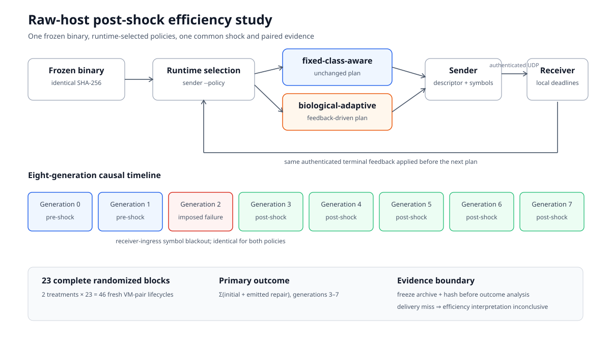

# Raw-host post-shock efficiency study v1

## Status and boundary

This is the proposed freeze for a confirmatory post-shock efficiency study. It
is ready for review but **does not authorize GCP execution**. Execution requires
a reviewed source SHA, an immutable tag resolving to that SHA and the separate
billing/teardown acknowledgement enforced by the runner.

The study follows the completed descriptive
[`raw-host-policy-pilot-v1-study-v4`](raw-host-policy-pilot-v1-final-results.md).
That pilot found saturated critical delivery but a possible efficiency signal:
biological-adaptive used 732 and 800 post-shock wire symbols in its two blocks,
while fixed-class-aware used 800 and 800. These observations motivate the
follow-up; they do not establish superiority.

The distinct study of whether a policy delivers critical data earlier remains
deferred until the efficiency evidence is sufficiently interesting. This study
makes no delivery-superiority claim.

## Scientific question and frozen factors

After the same policy-neutral terminal failure, does the unchanged
`biological-adaptive` controller use fewer wire-symbol datagrams during the
five scheduled post-shock generations than the unchanged
`fixed-class-aware` controller, without losing post-shock critical delivery?

The authoritative design is
[`gcp_raw_post_shock_efficiency_study_v1.json`](../benchmarks/gcp_raw_post_shock_efficiency_study_v1.json),
and its measurement contract is
[`raw_host_post_shock_efficiency_measurement_v1.json`](../benchmarks/raw_host_post_shock_efficiency_measurement_v1.json).
They reuse without modification:

- the `policy-pilot-v1` eight-generation workload and sequential authenticated
  terminal-feedback service;
- `regime-change-v1`, including the receiver-ingress symbol blackout for
  generation 2;
- the frozen forward and reverse traces and their SHA-256 digests;
- the non-peered cross-region public-IPv4 topology;
- protocol V3, libsodium HMAC-SHA-256 and the authenticated terminal ACK;
- all version-1 policy implementations and parameters.

All three policy definitions remain recorded and unchanged. The powered
contrast dispatches only `biological-adaptive` and `fixed-class-aware`.
`fixed-minimum` does not enter the primary estimand; dispatching it would add 23
lifecycles without increasing power for that contrast. Its pilot result remains
descriptive and is not reinterpreted.

| Window | Generations | Role |
|---|---:|---|
| Pre-shock | 0–1 | context only |
| Imposed shock | 2 | causal trigger, excluded from policy comparison |
| Post-shock | 3–7 | registered primary outcome window |

Generation 2 is the imposed perturbation, not a treatment outcome.



## Estimand and delivery guardrail

For each lifecycle, the primary outcome is the sum over generations 3–7 of
`initial_symbols + repair_symbols_emitted`. The denominator is always the five
**scheduled** generations, never delivered generations. A failure therefore
cannot improve efficiency by disappearing from the denominator.

Within each complete block, the contrast is
`biological-adaptive − fixed-class-aware`; negative values favor biological
efficiency. The confirmatory test is a two-sided one-sample Student t test on
the 23 paired block contrasts at `alpha=0.05`, with a two-sided 95% interval.

The guardrail requires all five post-shock critical segments to arrive before
their receiver-local descriptor-relative deadlines in both treatments in
every block. A miss remains in the data and makes the efficiency interpretation
inconclusive. It is not an exclusion and cannot be called a policy win.

Receiver deadlines remain entirely on the receiver steady clock. Sender expiry
values and cross-host clock subtraction are prohibited. Feedback RTT remains a
sender-steady application measurement, not one-way or network-only latency.

## Power and sample size

The machine-readable planning input is
[`raw_host_policy_pilot_v1_efficiency_planning_input.json`](../benchmarks/raw_host_policy_pilot_v1_efficiency_planning_input.json).
It is tied to the published pilot evidence and analysis checksums. The two
paired wire-symbol contrasts are `−68` and `0`.

Planning uses 70 symbols of dispersion: the full observed contrast range of 68
rounded upward to the next ten, rather than treating a two-block sample standard
deviation as precise. The minimum relevant power alternative is 50 wire symbols
per five-generation window: ten per scheduled generation, or 0.25 per
40-symbol source generation. It was chosen independently of the observed
biological mean and is 6.25% of the fixed pilot count of 800.

Fixed-seed Monte Carlo uses 100,000 trials per candidate and accepts a candidate
only when the one-sided 95% Wilson lower bound for power reaches 0.90:

| Complete blocks | Estimated power | Wilson lower bound |
|---:|---:|---:|
| 20 | 0.858440 | 0.856617 |
| 21 | 0.875670 | 0.873944 |
| 22 | 0.891420 | 0.889791 |
| **23** | **0.906640** | **0.905116** |
| 24 | 0.917500 | 0.916058 |
| 25 | 0.928780 | 0.927431 |

Twenty-three is the first admissible size. With two treatments per block, the
study contains exactly **46 fresh VM-pair lifecycles**. There is no
outcome-dependent stopping or replacement.

Reproduce the decision without cloud authentication:

```bash
python3 tools/gcp_raw_post_shock_power_analysis.py
```

## Technical validity and evidence freeze

Every lifecycle must show the generation-2 terminal failure and generation-3
plan, causal biological state update, invariant fixed-class-aware plan, eight
complete sender and receiver records with receiver-relative deadlines, frozen
identities and traces, matching log hashes, empty stderr and clean teardown.
All 46 lifecycles must use one identical runtime binary SHA-256.

A technically invalid lifecycle or cleanup stops collection immediately and is
not replaced. A scientific delivery miss is different: it remains a valid
observation and fails the delivery guardrail.

After collection and an independent cleanup audit, evidence is archived and
SHA-256 hashed **before** outcome analysis. The analyzer requires that archive
as input, records its digest and emits every block contrast plus per-generation
protection factors and adaptive state:

```bash
python3 tools/analyze_gcp_raw_post_shock_study.py \
  --project PROJECT_ID \
  --source-commit REVIEWED_SHA \
  --evidence-root raw-host-evidence/post-shock-efficiency-v1 \
  --frozen-evidence-archive FROZEN_EVIDENCE_ARCHIVE
```

The preregistered classifications are:

- guardrail failure: efficiency conclusion is inconclusive;
- the 95% interval excludes zero negatively and the point estimate reaches
  −50: statistically supported and practically relevant efficiency;
- the interval excludes zero but the estimate is smaller than 50 symbols:
  supported but below the registered relevance level;
- otherwise: no confirmatory post-shock efficiency advantage.

None establishes general policy superiority, field calibration or delivery
advantage.

## Frozen visual analysis

The outcome figures are registered before dispatch in
[`raw_host_post_shock_efficiency_visualization_v1.json`](../benchmarks/raw_host_post_shock_efficiency_visualization_v1.json).
The specification fixes the palette, block order, reference lines, full-block
display and four-figure set:

1. all 23 paired primary contrasts with the mean, two-sided 95% Student-t
   interval, zero and the registered −50-symbol relevance reference;
2. per-generation protection-factor means and full observed ranges for every
   policy and traffic class, with generation 2 marked as the common shock;
3. mean post-shock initial/repair composition while retaining every lifecycle
   wire-symbol total;
4. both policies' critical-before-deadline count in every block.

The visual contract prohibits outcome-dependent sorting or palette changes,
hiding delivery misses, ranking generation 2, truncating the primary axis or
replacing failed observations. The renderer consumes the frozen analysis JSON
and emits deterministic SVG plus a provenance manifest containing the analysis,
evidence, binary, visualization-spec and figure SHA-256 values:

```bash
python3 tools/render_raw_host_policy_visuals.py \
  --analysis FROZEN_ANALYSIS_JSON \
  --results-only \
  --output-dir FROZEN_FIGURE_DIRECTORY
```

The published descriptive pilot visuals and the data-neutral study diagram use
the same renderer and can be reproduced without cloud access:

```bash
python3 tools/render_raw_host_policy_visuals.py --output-dir docs/images
```

## Review and eventual execution

Plan validation performs no GCP call:

```bash
python3 tools/gcp_raw_post_shock_study.py \
  --project PROJECT_ID \
  --source-commit "$(git rev-parse HEAD)"
```

The PR must pass unit/process, single-image Docker and independent remote-host
validation on its exact SHA. After review, the reviewed source is tagged
immutably. Only then may an operator explicitly execute:

```bash
python3 tools/gcp_raw_post_shock_study.py \
  --project PROJECT_ID \
  --source-commit REVIEWED_SHA \
  --reviewed-source-commit REVIEWED_SHA \
  --experimental-tag raw-host-post-shock-efficiency-study-v1 \
  --execute \
  --acknowledge-billing-and-teardown
```

This PR stops before that command. It freezes and validates the design for
review; it does not dispatch GCP.
